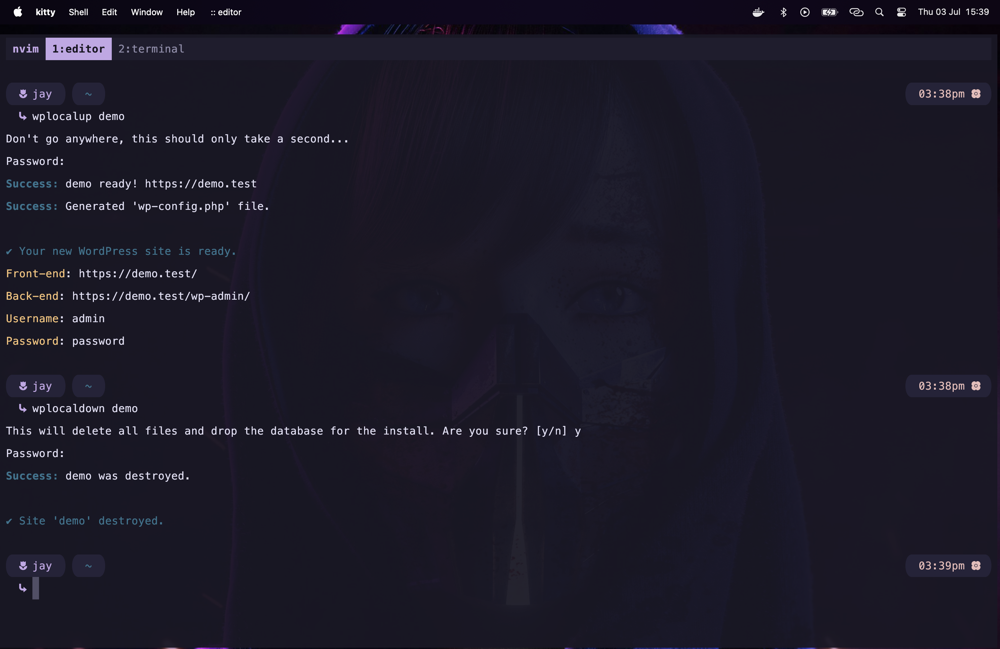

# spinwplocal

**spinwplocal** is a set of scripts that create and destroy local WordPress sites using Laravel
Valet and the WP-CLI Valet driver.

It automates local WordPress site setup with sensible defaults for fast and simple WP local dev env provisioning.

> **Note:** This tool is designed for macOS, leveraging Laravel Valet which is officially supported on macOS.
> Linux and Windows users may need to explore alternative local development solutions.

## Installation

### Requirements

Before installing, ensure the following are installed and configured:

- [Laravel Valet](https://laravel.com/docs/valet)
- [WP-CLI](https://wp-cli.org/)
- [WP-CLI Valet Command](https://github.com/aaemnnosttv/wp-cli-valet-command)
- PHP via [Homebrew](https://brew.sh/)

> **Note:** To avoid PHP deprecation warnings with `wp-cli-valet-command`
> (see [Issue #94](https://github.com/aaemnnosttv/wp-cli-valet-command/issues/94)),
> the `PHP_BIN` variable in the `.env.example` (copied to `.env` during install) is set by
> default to use PHP 8.0 (installed via Valet using Homebrew to `/opt/homebrew/opt/php@8.0/bin/php`).

#### PHP 8.0 Workaround

Using [Laravel Valet](https://laravel.com/docs/12.x/valet) the PHP deprecated warnings can be resolved by
using Valet to download and build PHP 8.0:

```bash
valet park
valet use php@8.0
```

### Fork and Clone the Repository

Fork this repo on GitHub, then clone your fork locally:

```bash
git clone https://github.com/yourusername/spinwplocal.git
cd spinwplocal
```

### Configure Install Settings

The install script was created for convenience and uses default variables that you can adjust if need be:

- `BIN_DIR="${HOME}/.local/bin"` — directory where executables will be symlinked; must be in your PATH
- `ENV_FILE=".env"` — environment configuration file
- `ENV_EXAMPLE_FILE=".env.example"` — example env file template
- `SCRIPTS="wplocalup wplocaldown"` — scripts to install

### Make the Install Script Executable

Set execute permissions on the install script:

```bash
chmod +x install
```

### Run the Installer

Run the installer script to set up the environment:

```bash
./install
```

- This copies `.env.example` to `.env` if it does not exist.
- creates the binary directory if it does not exist (**_note:_** the binary directory must be in your `PATH`)
- and symlinks the scripts into the `BIN_DIR`.

### Configuration

Edit the `.env` file to set your database credentials, PHP binary path, and other environment-
specific settings. This file is loaded by the `wplocalup` and `wplocaldown` scripts at runtime.

## Usage

Use the installed commands to create or destroy WordPress sites:

- `wplocalup <sitename>` — create a new local WordPress site
- `wplocaldown <sitename>` — destroy an existing local WordPress site



## Credits

This project was inspired by:

- The [SpinupWP blog post](https://spinupwp.com/laravel-valet-local-wordpress-dev/) by Jonathan
  Wold
- The [YouTube tutorial](https://www.youtube.com/watch?v=ujPFVGbWZ88) by [OxyProps](https://www.youtube.com/@OxyProps)

## License

This is a personal project and does not include a license. Use freely but at your own risk.
